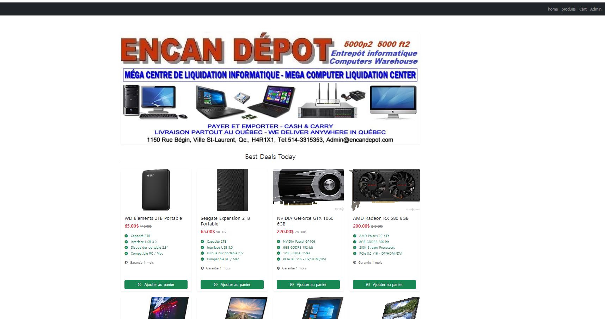
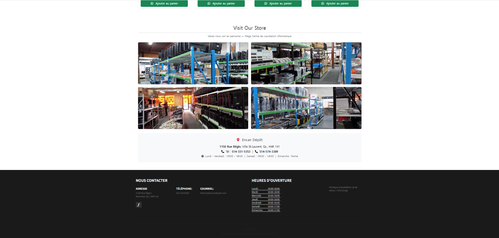

# encanDepo

Simple Django web shop for Encan Dépôt — a used computer liquidation store in Montréal.

Shows products on the homepage (laptops, desktops, external HDDs, GPUs) with their specs, prices, and store info.

## Screenshot





## Stack

- Python 3.7
- Django 2.2
- MariaDB 10.x
- Bootstrap
- Font Awesome

## Project structure

```
encanDepo/
├── depo/              # Django project (settings, urls, main view, templates, static)
├── product/           # Product app (model, admin, migrations)
├── db_backup/         # SQL dump + restore guide
├── manage.py
├── requirements.txt
└── README.md
```

## Setup

### Requirements

- Python 3.7+ (tested on 3.7)
- MariaDB / MySQL running on localhost:3306
- Git

### Steps

```bash
# 1. clone
git clone https://github.com/yongtaek12/encanDepo.git
cd encanDepo

# 2. create database (see db_backup/README.md for full guide)
mysql -u root -p
```
```sql
CREATE DATABASE encanDepoDb CHARACTER SET utf8mb4 COLLATE utf8mb4_unicode_ci;
CREATE USER 'user'@'localhost' IDENTIFIED BY '1234';
GRANT ALL PRIVILEGES ON encanDepoDb.* TO 'user'@'localhost';
FLUSH PRIVILEGES;
EXIT;
```
```bash
# 3. import sample data
mysql -u user -p1234 encanDepoDb < db_backup/encanDepoDb.sql

# 4. python venv + install deps
python -m venv .venv
.venv\Scripts\activate          # on Windows
# source .venv/bin/activate     # on macOS/Linux
pip install -r requirements.txt

# 5. run
python manage.py runserver
```

Open http://127.0.0.1:8000

## Admin

Visit http://127.0.0.1:8000/admin

Default superuser is `laund`. Password is not in this repo — reset it after restore:

```bash
python manage.py changepassword laund
```

Or create a new one:

```bash
python manage.py createsuperuser
```
